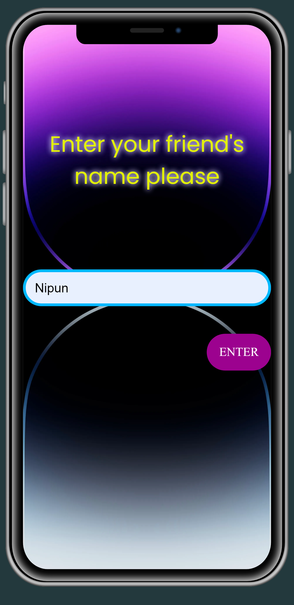
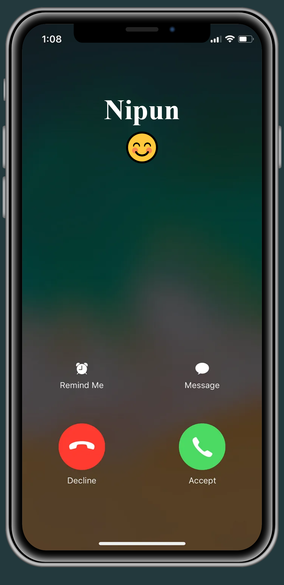
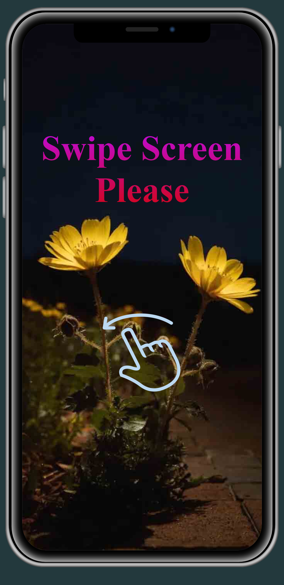

# Happy Birthday Supprise Web Page 

 This is a Static Web page code using HTML,CSSmJavaSCript

<h3> Iphone & Fire Works </h3>
 

  <h1> <a href="https://nipunsgeeth.github.io/Happy-Birthday-phone" >View Demo Page</a></h1>
   
  </a>
  

 

  
   
  
  

 
 

<h3> For use </h3>

<h4>1. Create a fork in your GitHub</h4>
<h4>2. Change your own texts in file text.js</h4>
<h4>3. Use your GitHub Pages or Build Your own web server</h4>
<h4>4. Send that link to your friend and Surprise him</h4>
<h4>5. Enjoy It</h4>
